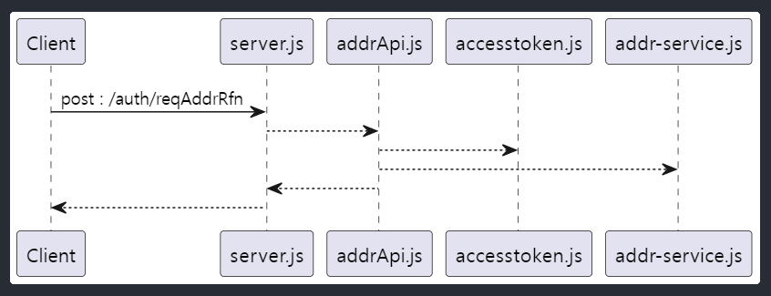

# Nodejs
크롬 V8에 비동기 이벤트 처리 라이브러리인 libuv를 결합한 플랫폼으로,
브라우져에서 동작하던 JavaScript 을 브라우져 밖에서도 실행 할 수 있도록 만든 플랫폼입니다.

## async / await
nodejs 를 제대로 사용하기 위해서는 async / await 를 이해 하여야 합니다.

[Javascript async 와 await](https://joshua1988.github.io/web-development/javascript/js-async-await/)

# NPM(Node Packaged Manager)
Java 진영의 Maven 이나 Gradle 과 같은 역활을 하는 툴 입니다.

[NPM 이란](https://velog.io/@yoojinpark/npm)

# 디렉토리 구조
 - api : request 응답 처리 및 response 생성 function 이 모인 디렉토리
 - config : 환경 설정 function 이 모인 디렉토리
 - service : 로직 처리 function 이 모인 디렉토리
 - server.js : 어플리케이션 시작 시점 js 파일
 - package.json : 어플리케이션 meta 정보 및 라이브러리 dependencies 관리 파일
 - .env.dev : 개발 환경 설정 정보 파일
 - .env.pord : 운영 환경 설정 정보 파일
 - start.bat : window 용 운영 실행 파일
 - start-dev.bat : windows 용 개발 실행 파일

# 어플리케이션 실행
1. 라이브러리 다운로드
```
npm install 
```
2. 어플리케이션 실행
script 는 package.json 에 명시 되어 있음
```aidl
// cf) package.json scripts
//"scripts": {
//    "start": "cross-env NODE_ENV=dev node server.js",
//    "watch": "cross-env NODE_ENV=prod nodemon ./ ./server.js",
//    "prod": "cross-env NODE_ENV=prod node server.js"
//  },
npm run [sciprt] 

// 또는 start.bat 실행
./start.bat
```
# Request 처리 흐름


# 환경 세팅
## cacheconfig.js
lru-cache 라이브러리를 이용하여 cj대한통운 token 값을 메모리에 저장하기 위한 설정
## dbconfig.js
DataBase 설정 정보
## envset.js
실행 환경을 동적으로 변경 하기 위한 설정 정보
## logger.js
로그를 위한 설정 정보
